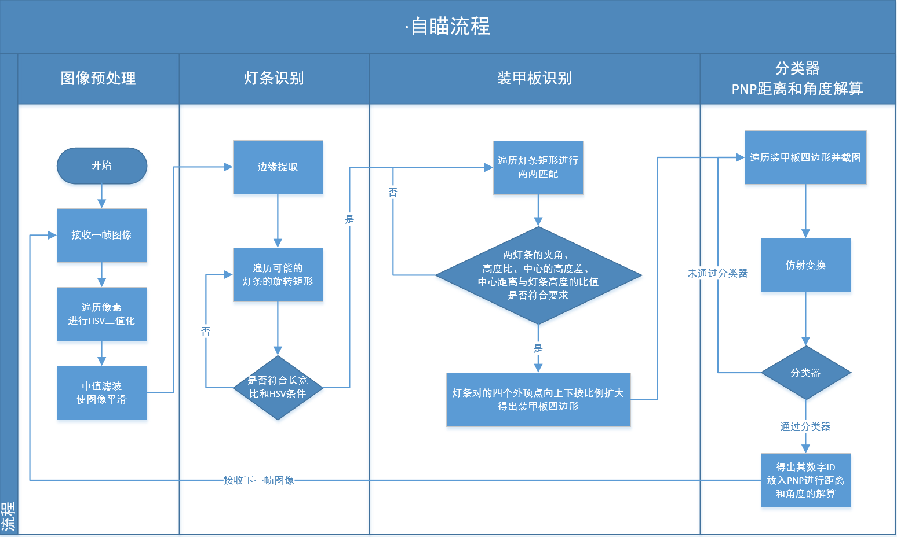

# Armor_Finder

| 作者   | 负责部分       |
| ------ | -------------- |
| 韩煦源 | 自瞄装甲板识别、分类器 |
| 曾宪坤 | PNP测距 |

## 一、代码运行环境

|操作系统|运行库|
|-------|--------|
|Ubuntu16.04<br />Windows WSL|OpenCV 3.4.7<br />cmake 3.15.4|

- 本代码统一使用**640×480**大小的图像进行处理

## 二、程序编译及运行

Ubuntu16.04（在项目文件夹下）

```shell
mkdir build
cd build
cmake ..
make
sudo ./main
```

## 三、文件结构目录

``` Files Structure
.
├── armor                   // 存放自瞄主要算法代码
│   ├── include             // 自瞄头文件
│   └── src                 // 自瞄源码
├── CMakeLists.txt          // cmake工程文件
├── image                   // 存放测试代码使用的图像
│   ├── dst                 // 存放原图像
│   └── src                 // 存放经代码处理后的图像
├── main.cpp                // 主函数
├── other                   // 存放一些其他代码，如计时器、drawText
│   └── include             // other头文件
├── README.md               // 代码手册
└── Video                   // 存放调试代码所需的视频文件以及分类器输出的截图
```

## 四、关键类解析  

### 一.Armor_Finder_RotatedRect  

#### 1.find lightbox  

 >(1)cv::findContours(mat,contours, CV_RETR_LIST,CV_CHAIN_APPROX_NONE） [^将二值化后的Mat进行边缘检测]  
 >(2)minAreaRect(contours[i])                                           [^取得轮廓的最小旋转矩形]
 >(3)screen lightboxes 筛选灯条  
    >>cv::Point2f vertices[4]; rect.points(vertices);                   [^旋转矩形的四个顶点Mat内部]  
    >>rotateRectToMat_isok(mat_real, rect);                             [^确保转正后的旋转矩形在Mat内部]  
    >>rotateRectToMat(mat_real, rect);                                  [^将旋转矩形所对应的区域内的图像转正]  
      >>>length_width_rate_thresh                                       [^长宽比阈值]  
      >>>hsv_isok(mat_imagepart, thresh_binar, thresh_value);           [^hsv检测]  
        >>>>cv::cvtColor(in, in2, CV_RGB2HSV);RGB图片像HSV颜色空间转变  
        >>>>cvGet2D(ipl_in2, rows/2, cols/2);                           [^遍历hsv中点像素值：筛选亮度和颜色]

#### 2.match lightbox_i_j  

 >(1)angle_isok(const cv::RotatedRect rect_i, const cv::RotatedRect rect_j)          [^角度差匹配]
 >(2)center_height_isok(const cv::RotatedRect rect_i, const cv::RotatedRect rect_j)  [^中心高度差匹配]
 >(3)center_distance_isok(const cv::RotatedRect rect_i, const cv::RotatedRect rect_j)[^中心距离和长度比匹配]
 >(4)length_rate_isok(const cv::RotatedRect rect_i, const cv::RotatedRect rect_j)    [^灯条长宽比匹配]  

#### 3.find armorbox  

 >get_armor(cv::Mat& mat_real, const cv::RotatedRect rect_i, const cv::RotatedRect rect_j)
     >>(1)情况一（up_right）：变换旋转矩形的坐标点顺序,确定p[0]与p[1]
     >>(2)情况二（！up_right）:无需变化  
      >>>vertices_dual_light[0] =
      >>>rect_l.size.width < rect_l.size.height ? vertices_l[0] : vertices_l[1]
      >>>vertices_dual_light[1] =
      >>>rect_l.size.width < rect_l.size.height ? vertices_l[1] : vertices_l[2];
      >>>vertices_dual_light[2] =
      >>>rect_r.size.width < rect_r.size.height ? vertices_r[2] : vertices_r[3];
      >>>vertices_dual_light[3] =
      >>>rect_r.size.width < rect_r.size.height ? vertices_r[3] : vertices_r[0];                   [^相对外侧的灯条点作为装甲板的顶点]

#### 4.line armorbox  

 >if(rect_l.size.width<rect_l.size.height)
         >>vertices_armor[1].x = (18.0/11.0)*vertices_dual_light[1].x - (7.0/11.0)*vertices_dual_light[0].x;
         >>vertices_armor[1].y = (18.0/11.0)*vertices_dual_light[1].y - (7.0/11.0)*vertices_dual_light[0].y;
         >>vertices_armor[0].x = (18.0/11.0)*vertices_dual_light[0].x - (7.0/11.0)*vertices_dual_light[1].x;
         >>vertices_armor[0].y = (18.0/11.0)*vertices_dual_light[0].y - (7.0/11.0)*vertices_dual_light[1].y;
  >>[^实例：通过灯条的凸点向外延伸，计算出整个装甲板的凸点坐标（四种情况依次选择）]  

#### 5.PNP_distance  

 >camera calibration [^相机标定]
   >>double m[3][3] = {{1056.641597953005, 0, 958.1078670170519}, { 0, 1055.821668018513, 558.7308899751256}, {0, 0, 1}};
   cv::Mat cam= cv::Mat(3, 3, CV_64F, m);[^相机内参]
   >>double n[5]={-0.4101674487087525,0.2060326419033235, 0.0007446583829303401, -0.0009071701383907473, -0.05685326030318479};
   cv::Mat dis=cv::Mat(1,5, CV_64F, n);//[^畸变参数]  
 >pts coordinate[^不规则矩形像素坐标]
 >world coordinate[^定义世界坐标]  
 >cv::solvePnP(obj,pnts,cam,dis,rVec,tVec,false,cv::SOLVEPNP_ITERATIVE);[^利用solvepnp解算出平移向量和旋转向量]  
 >cv::Rodrigues(rVec, rotM); [^罗德里格斯变化将旋转向量变化成旋转矩阵]
 >double theta_x = atan2(rotM.at(2, 1), rotM.at(2, 2));
  double theta_y = atan2(-rotM.at(2, 0),
                   sqrt(rotM.at(2, 1)*rotM.at(2, 1) + rotM.at(2, 2)*rotM.at(2, 2)));
  double theta_z = atan2(rotM.at(1, 0), rotM.at(0, 0));[^解出角度]  

#### 6.classier  

>proportion_thresh(src_grey, src_grey, 255, thresh_binar) [^二值化处理]
>ifstream template_filename_in(template_filename_list) [^读入模板]
>与模板比较，并打分，累计分数，得出装甲板号码

## 五、装甲板识别程序运行流程

- 首先对图像进行hsv二值化：将符合装甲板灯条hsv颜色的像素赋值为白色，其他像素赋值为黑色，并使用中值滤波使图像平滑
- 使用边缘提取获得可能是灯条的旋转矩形区域
- 根据旋转矩形的长宽比、旋转矩形对应原图区域像素的hsv明度筛选出灯条矩形
- 对所有可能的灯条进行两两匹配，根据两灯条夹角、两灯条的高度比、两灯条中心的高度差和两灯条中心的距离与灯条高度的比值进行筛选，得出符合条件的灯条对。
- 将灯条对的四个外顶点向上下按比例扩大至装甲板边缘，得出装甲板四边形
- 将装甲板四边形区域截图进行仿射变换得到装甲板图像并交给分类器判断，得出装甲板及其数字id
- 最后将框出的装甲板四边形放入PNP进行距离和角度的解算



## 六、代码命名规范

- 函数名：使用首字母小写的驼峰命名法
- 类型名：使用首字母大写的驼峰命名法
- 变量名：使用下划线分割命名法
  